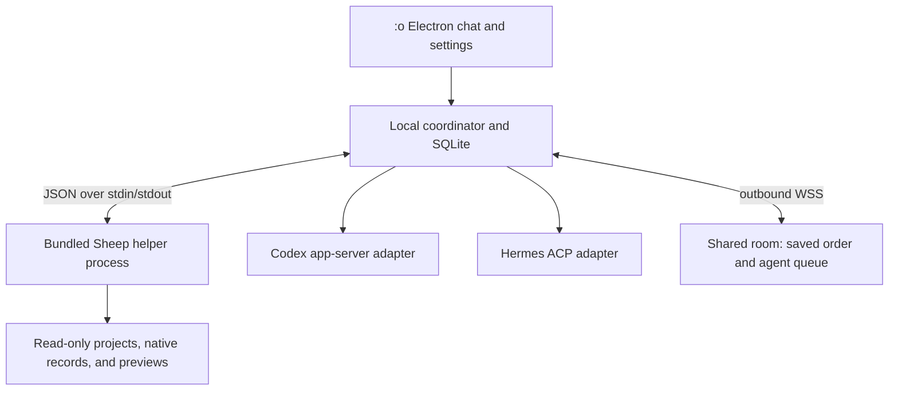

# MVP base and harness integration

Reviewed 2026-10-04 from local source and official protocol documentation. The Worker is deployed and healthy. The first workspace is initialized, the packaged app is signed in as owner, Sheep refresh runs in the app, and a local Codex agent profile is registered. Five app checks pass, lint passes, and the macOS arm64 package builds. Two friend invites and a three-device session remain. Agent execution on this computer is disabled until its owner enables it.

## Recommended MVP

| Part | Choice |
| --- | --- |
| Desktop base | Copy the reusable Electron/Vue/Quasar app shell from heyDataAgent into `app/`, then remove its heyData-specific features. |
| First runnable harnesses | Codex app-server and Hermes ACP, reusing the existing clients. |
| Discovery and native history | Sheep now has a versioned JSON bridge and paged native-record reads. The desktop copy builds and bundles the Sheep helper for this macOS arm64 checkout. |
| Local persistence | One Electron-owned SQLite writer for catalog, pending commands, run state, and applied shared events. JSON is an export. |
| Shared chat | Cloudflare Worker and SQLite Durable Object per room, with outbound WebSockets from each desktop. Deployed for this pilot. |
| Pilot | Three people, each with a named agent on their own machine. Two harness types are enough for three agents. |
| Trigger | `@agent_name`. Ordinary human messages never invoke a harness. |
| Ordering | Humans always send; one agent turn runs per chat. Mentioned agents queue and capture context when their turn starts. |
| Themes | Blue/red by default; Mint Green/Charcoal as Green mode instead of dark mode. |

## Existing code

| Project | Reuse | Changes needed |
| --- | --- | --- |
| heyDataAgent | Electron main/preload boundary, Vue chat and settings, Codex app-server client, Hermes ACP client, permission dialogs, optional terminal. | Remove heyData sign-in, API bridge, compliance workflows, Google directory tools, prompts, branding, and environment-specific storage. Split the large chat page into room, composer, participant, settings, and adapter components. |
| BABA-chat | Same Electron/Vue foundation and Codex app-server, chat/settings, optional terminal. | Also requires removing corpus retrieval, research prompts, and source selectors. It has no Hermes ACP client in the inspected app. Prefer heyDataAgent for this pilot. |
| Sheep | Cross-harness discovery, project grouping, native session references, portable transcript loading, resume/switch behavior. | Keep improving generic native readers in Sheep. :o launches the bundled executable in JSON bridge mode; live execution stays in :o's structured harness adapters. |

### heyDataAgent findings

- [Codex client](/Users/alejandrocamus/Documents/devHeyData/heyDataAgent/src-electron/codex-app-server.ts): account/model methods, thread listing/start/resume, turn start/interrupt, and server-request responses.
- [Hermes client](/Users/alejandrocamus/Documents/devHeyData/heyDataAgent/src-electron/hermes-acp.ts): session creation/loading, models, streaming, tool activity, cancellation, and permission requests.
- The Hermes launcher patches internal Hermes behavior and names version `0.21.3` as its tested target. Reuse the client; review the launcher separately. Prefer stock `hermes acp` where sufficient, retaining only patches the pilot actually needs. See [launcher](/Users/alejandrocamus/Documents/devHeyData/heyDataAgent/tools/hermes/heydata_acp.py).
- [Chat submission](/Users/alejandrocamus/Documents/devHeyData/heyDataAgent/src/pages/IndexPage.vue): returns while the conversation is busy, requires heyData sign-in, and starts a model turn on every send. Replace this with independent human-message submission and explicit mention routing.
- A conversation currently has one `mode` and one `threadId`. :o needs a room with multiple participants and a separate native-session binding for each owned agent.
- [Persistence](/Users/alejandrocamus/Documents/devHeyData/heyDataAgent/src-electron/electron-main.ts): rewrites a per-environment JSON array, capped at 100 conversations. This is not the shared event log or all-harness catalog we need.
- Both desktop apps' `npm test` scripts report that no test is specified. Existing adapters are implementation assets, not proof that this pilot works.
- heyDataAgent has no committed HEAD in the inspected checkout. Record source file hashes when copying; do not describe it as a pinned release.

### Copy boundary

| Keep and adapt | Remove from the new app |
| --- | --- |
| App/build configuration, generic chat layout, settings controls, main/preload IPC, native adapters, permission handling. | heyData authentication and endpoints, domain CLI/tools, compliance workflows, Google integration, domain agent instructions, brand assets, runtime conversation stores. |
| Local harness credentials remain with their owner; reuse suitable secure-storage handling for app-specific settings. | Source `.git`, `node_modules`, build output, caches, local credentials, and private runtime data. |
| Record where each reused adapter came from so fixes can be ported later. | Product-specific fallbacks that silently launch the wrong workflow or use another app's user-data directory. |

## Where Sheep fits

- Bundle the compiled Sheep executable with :o. Electron's main process starts `sheep bridge --stdio` as a background child process and exchanges JSON lines over stdin/stdout. Sheep is still an executable invoked with CLI arguments, but its interactive terminal UI is not embedded or shown. The user sees :o's project/chat UI. Node supports asynchronous child processes and piped output. See [Node child-process documentation](https://nodejs.org/api/child_process.html).
- The bridge exists in Sheep. It uses request IDs, a `sheep.bridge.v1` protocol field, bounded native-record pages, and stderr for diagnostics. The app does not parse Sheep's menus or human-readable CLI output.
- Implemented operations: `health`, `projects.list`, `conversations.list`, `conversations.read`, `conversations.readNative`, and `refresh`.
- `conversations.readNative` accepts a harness, session ID, cursor, and page limit. Sheep resolves the session from its latest inventory; the caller cannot pass an arbitrary source path.
- Sheep is Go; :o is TypeScript. This integration uses a compiled executable, rather than a TypeScript source import. A future Go consumer could use public packages, but Sheep's current `internal/` packages cannot be imported by an unrelated project. See [Go internal-package rules](https://go.dev/doc/go1.4#internalpackages).
- Sheep's bridge, native reader, and native import changes are committed as `6e44c568f0c04071859c5357b0565c83ddf4ed25`. The bundled helper's Go build metadata identifies that clean revision; :o's build script currently rebuilds from the local Sheep checkout. The checked-in app resource is specific to this macOS arm64 environment. Release packaging still needs a reproducible pinned Sheep revision and a matching binary for each supported OS/architecture. The pilot does not search for an arbitrary global Sheep installation.
- Keep live prompt submission, approvals, streaming, and stopping in the Codex/Hermes clients already available in the desktop base.
- Do not have Sheep and :o independently launch or control the same native session at once.
- Settings choose executable/config roots, default harness/model, and each named agent's working directory. The choice of a default harness does not filter out other harnesses' chats.
- A repository directory is not necessarily where the harness stores conversations. Discover each harness's data/config roots as well as each session's working directory.

### What Sheep currently provides

- Six registered readers: Codex, Claude, Pi, Hermes, OpenCode, and Antigravity. Coverage is best effort, not a guarantee of every session. See [reader registration](/Users/alejandrocamus/Documents/dev/sheep/internal/conversations/sqlite.go).
- [Conversation summaries](/Users/alejandrocamus/Documents/dev/sheep/internal/conversations/conversations.go): native session ID, harness, working directory, title, activity time, source location, and compaction status.
- Stable key within the local registry: `harness:session_id`. :o must also include connection/device identity, since roots and devices can contain colliding IDs.
- Portable messages remain the compact role/text/timestamp projection used for handoffs. They do not preserve the complete source event/tool/attachment structure or participant/model attribution.
- Cross-harness checkout now imports the portable transcript into a separate native target session and resumes that target. Codex, Claude, and Pi have format writers; Hermes and OpenCode use their CLI import commands. Existing source sessions are untouched, and Sheep does not link or deduplicate the separate source and target conversations. Antigravity import returns an unsupported error. The conversion carries readable text, not the complete tool, media, or reasoning state.
- The JSON bridge has no import operation. The current app uses its readers and cannot offer this checkout feature through its existing bridge calls. To add a chat-level harness switch, expose a structured import operation returning the target ID, harness, and working folder. Let :o use its native adapter to resume that target; shared participants, membership, and agent-turn routing must remain owned by :o.
- These limitations belong to the portable projection, not necessarily to the source data. `ReadNative` now exposes source records separately, and live structured adapter events remain necessary for streaming and approvals.

### Reader changes in Sheep

| Output | Preserve | Consumer |
| --- | --- | --- |
| Session summary | Native ID, source, project path, title, activity, and known model/harness metadata. | Sheep listings and :o's private catalog. |
| Portable transcript | Readable role/text/timestamp history. | Sheep's native import converters; fallback transcript handoff. |
| Rich session | Available messages/content blocks, tool calls/results, model/usage metadata, timestamps, event IDs, branches, and compaction records. Keep unknown native fields alongside normalized fields. | :o imports; possible Sheep detail/search/export views. |
| Source records | Reader-dependent original JSON/JSONL records or session-scoped database rows, with source references. Do not discard records just because they have no visible message text. | Local archives, debugging readers, and future reprocessing. |
| Artifact references | Referenced images/files, locations, available hashes, and whether the content is accessible. Load large content only when requested. | Preview/export, without putting every attachment into every JSON response. |

- `ReadNative` is additive to the existing `Reader.Load` portable path. It has reader-specific preservation coverage; do not treat every reader as a complete raw archive, and do not use the shortened prompt renderer for archiving.
- Codex's current loader ignores non-message response items and replaces earlier text at compaction. Pi also replaces earlier text with summaries. Preserve the original records independently of the current visible/active history.
- Hermes currently flattens content blocks to text. Preserve whole records, including fields the typed parser does not know, before producing the text projection.
- Database readers must select the requested session's records consistently. Do not export an entire database containing unrelated sessions. Preserve source row IDs and payloads; report paging limits and unsupported schema versions.
- Pages report whether more records remain and can include reader notes. Coverage still varies by harness; missing artifacts and some unavailable metadata are not yet normalized into one completeness report. Data already deleted by a harness cannot be recovered by adding a reader.
- Source native files stay read-only. Sheep's explicit import creates one new target session; it does not edit existing sessions. The current :o bridge only reads native files. Shared participant IDs, friend permissions, room order, and cloud synchronization stay in :o.
- Rich data is useful in Sheep too: inspect tool activity, preview files, show model/usage when recorded, and export history without reducing everything to text. Keep this as an on-demand detail path so ordinary lists and the compact checkout stay readable.

### Performance

| Operation | Keep the work bounded |
| --- | --- |
| List chats/projects | Return summaries; cache discovery results and refresh changed sources. Do not attach every transcript. Some current readers already parse whole session files, so this path also deserves optimization. |
| Open a chat | Load that session on demand, with bounded pages. Reuse its parsed source records for the readable and rich views where practical. |
| Follow a growing session | Use reader-specific cursors/checkpoints for append-only data; detect rewrites, compaction, and database updates before falling back to a reread. |
| Export history/assets | Stream records with backpressure. Read large assets separately and make progress/cancellation available. |
| Existing Sheep commands | Same-harness checkout resumes natively. Cross-harness checkout converts the readable transcript into a new native session. Rich preservation/export remains a separate path. |

- Rich reads add I/O, parsing, memory, and transfer cost when a person opens a selected session. The app requests them on demand and stores pages locally; it does not put the full native history into the project/chat list response. This keeps the default list path separate, but it is not a measured performance result.
- A page limits the returned records, not necessarily all source work. Some file readers scan from the beginning to reach a later cursor, so opening many pages of a large session can reread earlier bytes. Optimize with byte-offset checkpoints or source-specific cursors if measurements show this matters.
- A background process avoids spawning one process per request, but uses resident memory. Start it when needed and supervise its exit/restart without blocking the renderer.
- Compare listing latency, selected-session memory, and incremental-read cost before claiming the reader adds no overhead.

## Chat UI for the three of us

| Area | MVP behavior |
| --- | --- |
| Left drawer | Projects, private local chats, and shared chats. Native chats show their source harness; private history stays local until selected for sharing. |
| Center | One chronological chat, author name, human/agent tag, streamed agent output, files, and a composer that stays usable. |
| Right drawer | Three humans, their named agents, owner, harness, model when known, online state, and working/queued state. |
| Mentions | Completion for `@alex-agent`, `@jo-agent`, etc. Show owner and availability. Check permission before executing on the owner's machine. |
| Settings | Connect Codex/Hermes, select models/defaults, configure named agents and project folders, choose Blue/red or Green. |
| Projects | Show all linked harnesses and agents with activity. The most recently used harness is a default, not the project's only harness. |
| Shared chats | Can contain several harnesses. Show agent/harness attribution on agent messages; keep private native session paths local. |
| Notifications | Unread human messages, human mentions, agent completion/failure, and channel mute. |

### Agent execution

1. A person sends a message; save it in the room regardless of whether an agent is running.
2. An `@agent_name` mention queues an invocation. No mention means no harness run.
3. When the room is free and the owner is online/authorized, claim the next eligible turn atomically.
4. Capture completed shared context and reserve the reply position at turn start.
5. The owner's Electron process submits through the chosen adapter into a dedicated native session bound to that room/agent.
6. Persist streamed batches in the room and fill the reply in place for all three clients.
7. Release the chat's active turn after completion, failure, or confirmed stop. A temporary disconnect or tool/permission wait does not start another agent.
8. Apply reconnect replay locally. Keep pending commands and applied event cursors durable.

- Existing private sessions can contain private context. Default shared-room bindings to new dedicated native sessions; reusing old history requires an explicit reviewed import.
- Agent requests from friends use the owner's local tools and budget. Owner approvals stay on that owner's desktop.
- If an owner's app is closed, show their agent offline and keep the request waiting or allow cancellation. Do not execute it on another person's machine automatically.
- Human-only messages belong in :o. Include them in the next submitted harness prompt; do not fabricate native turns just to insert every shared human message.

## Catalog, live events, and JSON

| Data | How :o obtains it | Storage |
| --- | --- | --- |
| Project/session inventory | Sheep's read-only readers and registry, plus native API catalogs where available. | Local catalog; no automatic cloud publication. |
| Selected historical chat | Improved Sheep rich reader or native API, with source references and available raw records. | Private :o copy first; share only reviewed content. |
| New shared human message | :o composer and room protocol. | Authoritative room event plus local cached projection. |
| New agent output/tools | Structured Codex/Hermes events. Native stores can reconcile history after restart. | Run-scoped :o records; private tool data stays local unless explicitly shared. |
| JSON transcript | Deterministic export from the stored records. | :o-owned file. Never a shared file four processes rewrite concurrently. |

- Separate `project_id`, `room_id`, `participant_id`, `connection_id`, native session ID, run ID, and source event ID.
- Group local projects by normalized working directory and repository identity; retain branch/worktree distinctions. Session IDs remain harness-scoped.
- A project can have multiple agents and harnesses. A chat records the harness/model used by each agent turn, including changes over time.
- Keep participant shades stable by participant ID, not list position. Never deduce a person or model from a color or filename.
- Process partial native writes, rescans, compaction, and session branches through harness-specific readers. Deduplicate against live events; do not replay imported turns as new agent invocations.
- Preserve full available source records separately from the display projection. Add this capability to Sheep instead of duplicating all harness file readers in :o; its current portable text remains useful for previews and handoffs.
- Native stores remain harness-owned. Submit through their APIs and let them write their own formats; :o does not inject its metadata into those files.

## Additional adapters

| Harness | Integration | Timing |
| --- | --- | --- |
| Codex | Existing local `codex app-server` client, bidirectional JSON-RPC on stdio. | MVP. |
| Hermes | Existing ACP client; stock `hermes acp` JSON-RPC on stdio where sufficient. Gateway offers additional controls. [Hermes documentation](https://hermes-agent.nousresearch.com/docs/developer-guide/programmatic-integration/). | MVP; check launcher/version compatibility. |
| Pi | Native `pi --mode rpc`, JSON input/output and streamed events. ACP wrapping is optional. [RPC protocol](https://github.com/earendil-works/pi/blob/main/packages/coding-agent/docs/rpc.md). | First candidate after the pilot, or replace one initial adapter if a collaborator requires Pi. |
| OpenCode | `opencode serve`, HTTP/OpenAPI and SSE events. [Server documentation](https://opencode.ai/docs/server/). | After the pilot. |
| Claude | TypeScript/Python Agent SDK, which runs the Claude Code binary and exposes sessions, streaming, permissions, and hooks. [SDK documentation](https://code.claude.com/docs/en/agent-sdk/overview). | After the pilot; decide supported authentication before promising reuse of existing account credentials. |
| GitHub Copilot | Copilot SDK manages a CLI server and communicates through JSON-RPC. [SDK architecture](https://github.com/github/copilot-sdk#architecture). | After the pilot. |

- Use one adapter contract for capabilities, session creation/resume, prompt submission, events, model settings, approvals, and stop.
- Normalize display events without discarding the original supported payload. Preserve differences instead of claiming identical capabilities.
- A discovered chat can be viewable before its harness has a runnable :o adapter. Show that distinction plainly.

## Next steps

| Order | Task | Done when |
| --- | --- | --- |
| 1 | Copy heyDataAgent's reusable app into `app/` and remove domain features. | Done in the local copy. The Electron build succeeds. |
| 2 | Retain Codex/Hermes clients and connect the settings and agent runner. | Adapter code is connected. Live session behavior still needs a real local run. |
| 3 | Add participant/room/run data and local SQLite persistence. | Local persistence, message outbox, room events, and agent-session mappings are implemented. Local integration covers three members, WebSocket delivery, message order, queued agents, and idempotent sends. |
| 4 | Improve Sheep's native readers, add JSON bridge mode, and bundle the helper. | Bridge and paged reads compile in Sheep and the current macOS helper is built. Pinning/releasing binaries for other OS/architectures remains. |
| 5 | Build the shared chat UI and both themes. | UI code is in the app copy; the packaged app connects to the deployed room and loads the `general` chat. |
| 6 | Implement sign-in/invitations and the cloud room protocol. | Worker deployed and healthy at `https://surprised-face-rooms.camus-00.workers.dev`; workspace bootstrapped and owner app authenticated. Friend invites and a three-device run remain. |
| 7 | Bind each owned agent to its local project and dedicated native session. | A local Codex profile is registered for the surprised-face project. Remote agent requests remain disabled; a live model turn and dedicated-session behavior still need a pilot run. |
| 8 | Exercise reconnects, queued mentions, approvals, and output sharing with the collaborators. | Do this in the pilot and record only actual workflow evidence in `tests.html`. |
| 9 | Try the app together, then add adapters and advanced orchestration. | Expand harness coverage after the three-person workflow has been tried. |

## Remaining choices

| Choice | Suggested pilot default |
| --- | --- |
| Desktop OS | macOS first if all three collaborators use it. Confirm before packaging; Sheep's scheduling/launcher includes macOS-specific behavior. |
| Agent ownership | One named agent per person, with Codex/Hermes chosen per agent rather than one global room setting. |
| Friend permissions | Remote requests stay queued while the owner's local execution switch is off. Leave it off until the owner is ready to run friends' requests on this machine. |
| Shared history | Start a fresh shared room. Import private chats only after reviewing the selected history. |
| Backend identity | Cloudflare Worker with private invite codes for the three-person pilot. |
| Source sharing | Confirm which copied application code can be published before a public release; the inspected desktop packages are private and have no root license file. |
